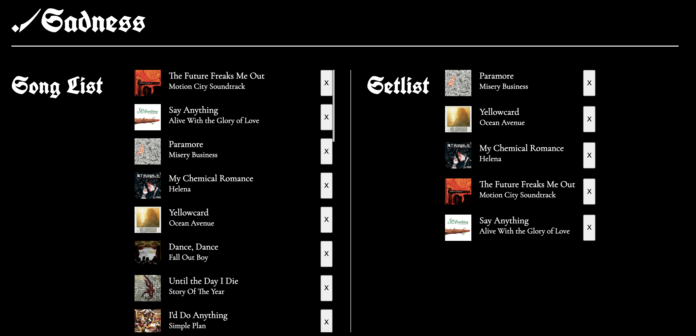

# ./Sadness



By day you're a coder [working in an office](https://www.youtube.com/watch?v=9QQQetnmxcw), but your heart, your _FEELINGS_, need a release. Naturally, you've decided to start an emo cover band called "./Sadness" with your fellow Flatiron alumni.

After days of practice you've decided you have the skills to play a small show at your friend's Brooklyn loft. Last step is to build a playlist that will bring down the house.

[Primo Emo Spotify Playlist](https://open.spotify.com/playlist/24AulAf9bmWFqqUSi5y7Sj?si=4f048dfe53ff4c76)

## Instructions

For this project, you’ll be building out a React application that displays a
list of songs, among other features. Try your best to find the right
places to insert code into the established code base.

Part of what this code challenge is testing is your ability to follow given
instructions. While you will definitely have a significant amount of freedom in
how you implement the features, be sure to carefully read the directions for
setting up the application.

## Setup

1. Run `npm install` in your terminal.
2. Run `npm run server`. This will run your backend on port `3110`.
3. In a new terminal, run `npm start`.

Make sure to open [http://localhost:3110/tracks](http://localhost:3110/tracks) in
the browser to verify that your backend is working before you proceed!

The base URL for your backend is: `http://localhost:3110`

## Core Deliverables

As a user, I should be able to:

- See all the details of the songs rendered in `SongList`.
- Add a song from the `SongList` to `Setlist` by clicking on it. The selected song should render in the `Setlist` component. The song can be added only **once**. The item **does not** disappear from the `SongList`.
- Remove a song from `Setlist` by clicking on it. The song should disappear from the `Setlist` component.
- Remove a song forever </\3 by clicking the delete button at the bottom of the each `Song`. This should delete the song from both the backend and the frontend.

### Endpoints for Core Deliverables

#### GET /tracks

Example Response:

```json
[
    {
        "id": 1,
        "artist": "Motion City Soundtrack",
        "song": "The Future Freaks Me Out",
        "image": "./images/motion-city-soundtrack-i-am-the-movie.jpeg"
    },
    {
        "id": 2,
        "artist": "Alive With the Glory of Love",
        "song": "Say Anything",
        "image": "./images/say-anything-is-a-real-boy.jpeg"
    },
    {
        "id": 3,
        "artist": "Misery Business",
        "song": "Paramore",
        "image": "./images/paramore-riot.jpeg"
    }
]
```

#### DELETE /shows/:id

Example Response:

```json
{}
```
